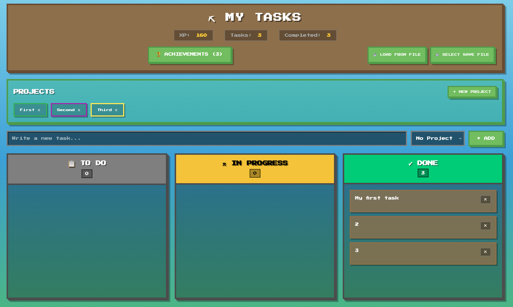
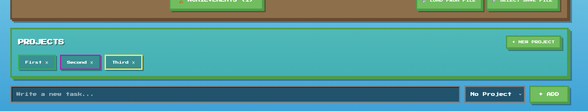
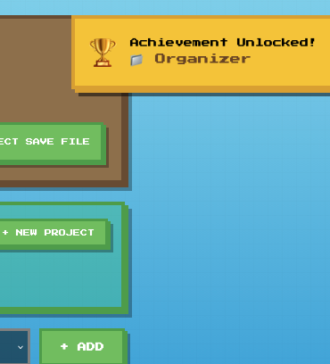
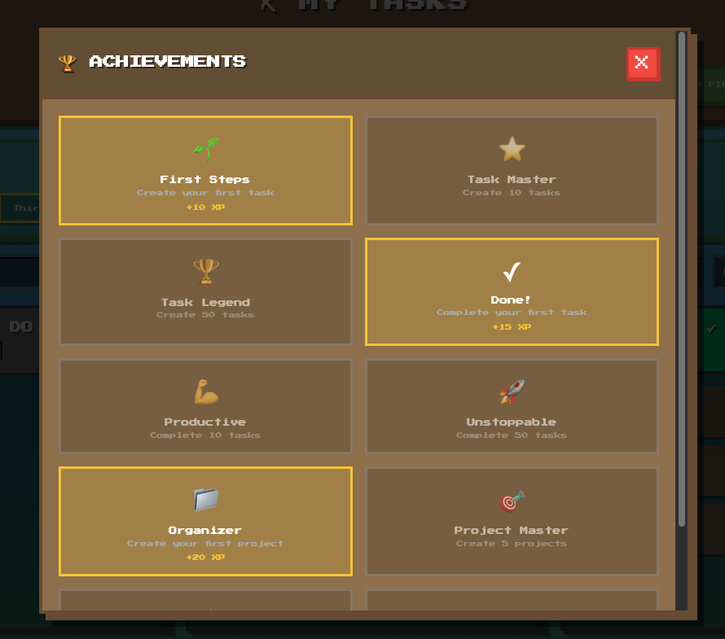

# ⛏ Minecraft Task Board

> A pixel-perfect task management board with achievements, inspired by Minecraft aesthetics

[](https://github.com/Krymets/MinecraftTaskBoard)
[](https://github.com/Krymets/MinecraftTaskBoard)
[](LICENSE)

```
███╗   ███╗██╗███╗   ██╗███████╗ ██████╗██████╗  █████╗ ███████╗████████╗
████╗ ████║██║████╗  ██║██╔════╝██╔════╝██╔══██╗██╔══██╗██╔════╝╚══██╔══╝
██╔████╔██║██║██╔██╗ ██║█████╗  ██║     ██████╔╝███████║█████╗     ██║
██║╚██╔╝██║██║██║╚██╗██║██╔══╝  ██║     ██╔══██╗██╔══██║██╔══╝     ██║
██║ ╚═╝ ██║██║██║ ╚████║███████╗╚██████╗██║  ██║██║  ██║██║        ██║
╚═╝     ╚═╝╚═╝╚═╝  ╚═══╝╚══════╝ ╚═════╝╚═╝  ╚═╝╚═╝  ╚═╝╚═╝        ╚═╝

████████╗ █████╗ ███████╗██╗  ██╗    ██████╗  ██████╗  █████╗ ██████╗ ██████╗
╚══██╔══╝██╔══██╗██╔════╝██║ ██╔╝    ██╔══██╗██╔═══██╗██╔══██╗██╔══██╗██╔══██╗
   ██║   ███████║███████╗█████╔╝     ██████╔╝██║   ██║███████║██████╔╝██║  ██║
   ██║   ██╔══██║╚════██║██╔═██╗     ██╔══██╗██║   ██║██╔══██║██╔══██╗██║  ██║
   ██║   ██║  ██║███████║██║  ██╗    ██████╔╝╚██████╔╝██║  ██║██║  ██║██████╔╝
   ╚═╝   ╚═╝  ╚═╝╚══════╝╚═╝  ╚═╝    ╚═════╝  ╚═════╝ ╚═╝  ╚═╝╚═╝  ╚═╝╚═════╝
```

## 🎮 Overview

Manage your tasks like a Minecraft pro! This project brings the beloved blocky aesthetics of Minecraft to a fully functional task management board. Track your progress, organize projects, and unlock achievements as you complete tasks.

**🚀 Zero dependencies • 💾 Auto-save to file • 🎨 Pixel-perfect design • 🏆 10 Achievements • ⚡ Lightning fast**

### 🌐 Live Demo

**Try it now:** [https://krymets.github.io/MinecraftTaskBoard](https://krymets.github.io/MinecraftTaskBoard)

No installation required - just open and start managing your tasks!

---

## ✨ Features

### 📊 **Kanban Board**
Drag and drop tasks between three status columns:
- 📋 **TO DO** - Tasks waiting to be started
- ⚒ **IN PROGRESS** - Tasks you're actively working on
- ✅ **DONE** - Completed tasks (earn bonus XP!)

### 🎯 **Project Management**
- Create unlimited projects with custom colors
- Filter tasks by project
- Organize your work across multiple initiatives
- Delete projects without losing tasks

### 🏆 **Achievement System**
Unlock 10 achievements as you use the board:

| Icon | Achievement | Description | XP |
|------|-------------|-------------|-----|
| 🌱 | **First Steps** | Create your first task | 10 XP |
| ⭐ | **Task Master** | Create 10 tasks | 50 XP |
| 🏆 | **Task Legend** | Create 50 tasks | 200 XP |
| ✓ | **Done!** | Complete your first task | 15 XP |
| 💪 | **Productive** | Complete 10 tasks | 75 XP |
| 🚀 | **Unstoppable** | Complete 50 tasks | 300 XP |
| 📁 | **Organizer** | Create your first project | 20 XP |
| 🎯 | **Project Master** | Create 5 projects | 100 XP |
| ⚡ | **Speed Runner** | Complete 3 tasks at once | 50 XP |
| 💎 | **XP Hunter** | Earn 500 XP | 0 XP |

### 💾 **Smart Persistence**
- **LocalStorage**: Automatic browser storage
- **File System**: Auto-save to `tasks.json` on every change
- **Import/Export**: Backup and restore your data anytime

### 🎨 **Minecraft Aesthetics**
- Pixel-perfect Press Start 2P font
- 3D block shadows on all elements
- Classic Minecraft color palette (grass, dirt, stone, diamonds!)
- Retro pixel grid background
- Animated achievement notifications

---

## 📸 Screenshots

### Main Board
The full Kanban board with tasks in different columns, projects filter, and stats display.



### Project Management
Organize tasks across multiple projects with custom colors and easy filtering.



### Achievement Unlocked!
Get instant notifications when you unlock achievements as you progress.



### Achievements Gallery
Track your progress with 10 unique achievements to unlock.



---

## 🚀 Quick Start

### 📦 Download

**Option 1: Clone the repository**
```bash
git clone https://github.com/Krymets/MinecraftTaskBoard.git
cd MinecraftTaskBoard
```

**Option 2: Download ZIP**
1. Click the green "Code" button above
2. Select "Download ZIP"
3. Extract the archive

### 🎮 Usage

1. **Open the app**
   ```bash
   # Simply open index.html in your browser
   open index.html
   # Or double-click the file
   ```

2. **Create your first task**
   - Type your task in the input field
   - (Optional) Select a project
   - Hit Enter or click "Add"
   - 🎉 Achievement unlocked: "First Steps"!

3. **Organize with projects**
   - Click "+ New Project"
   - Choose a name and color
   - Filter tasks by clicking project chips

4. **Move tasks**
   - **Drag & drop** tasks between columns
   - Watch your XP grow as you complete tasks!

5. **Enable auto-save** (recommended)
   - Click "📁 Select Save File"
   - Choose `tasks.json` in the project folder
   - All changes now auto-save to the file!

6. **Backup your data**
   - Click "📂 Load from File" to restore from `tasks.json`
   - Data also persists in browser LocalStorage

---

## 🛠️ Technical Details

### Stack
- **HTML5** - Semantic structure
- **CSS3** - Pixel-perfect Minecraft styling
- **Vanilla JavaScript** - Zero dependencies!
- **File System Access API** - Modern browser file operations

### Browser Support
- ✅ Chrome 86+
- ✅ Edge 86+
- ✅ Opera 72+
- ⚠️ Firefox (LocalStorage only, no file auto-save)
- ⚠️ Safari (LocalStorage only, no file auto-save)

### File Structure
```
minecraft-task-board/
├── index.html          # Main HTML structure
├── style.css           # Minecraft-themed styles
├── script.js           # Core application logic
├── tasks.json          # Your saved tasks (auto-generated)
└── README.md           # You are here!
```

### Data Schema
```json
{
  "tasks": [
    {
      "id": 1730000000000,
      "text": "Complete the README",
      "status": "done",
      "projectId": 1730000000001,
      "createdAt": "2025-11-03T10:00:00.000Z"
    }
  ],
  "projects": [
    {
      "id": 1730000000001,
      "name": "Documentation",
      "color": "#2196F3"
    }
  ],
  "stats": {
    "xp": 125,
    "tasksCreated": 5,
    "tasksCompleted": 3,
    "projectsCreated": 2
  },
  "achievements": [
    {
      "id": "first-task",
      "unlocked": true
    }
  ]
}
```

---

## 🎯 Roadmap

- [ ] Dark mode toggle
- [x] **Task priorities (Low/Medium/High/Critical)** ✅
- [ ] Due dates with calendar picker
- [ ] Task descriptions/notes
- [ ] Subtasks/checklists
- [ ] Search and filter
- [ ] Task tags
- [ ] Multiple board views (List, Grid)
- [ ] Keyboard shortcuts
- [ ] More achievements (100+ total)
- [ ] Sound effects (Minecraft sounds!)
- [ ] Task history/timeline
- [ ] Collaboration features
- [ ] Mobile app (PWA)

---

## 🤝 Contributing

Contributions are welcome! Whether it's:
- 🐛 Bug fixes
- ✨ New features
- 📝 Documentation improvements
- 🎨 UI/UX enhancements
- 🌍 Translations

### How to Contribute

1. **Fork the repository**
2. **Create your feature branch**
   ```bash
   git checkout -b feature/AmazingFeature
   ```
3. **Commit your changes**
   ```bash
   git commit -m '✨ Add some AmazingFeature'
   ```
4. **Push to the branch**
   ```bash
   git push origin feature/AmazingFeature
   ```
5. **Open a Pull Request**

### Development Guidelines
- Keep the vanilla JS approach (no frameworks)
- Maintain the Minecraft aesthetic
- Test in Chrome, Firefox, and Safari
- Update README if adding features
- Follow existing code style

---

## 📜 License

This project is licensed under the **MIT License** - see the [LICENSE](LICENSE) file for details.

### MIT License Summary
✅ Commercial use
✅ Modification
✅ Distribution
✅ Private use

---

## 🙏 Acknowledgments

- **Font**: [Press Start 2P](https://fonts.google.com/specimen/Press+Start+2P) by CodeMan38
- **Inspiration**: Minecraft by Mojang Studios
- **Icons**: Native emoji characters
- **Made with**: ☕ Coffee and lots of ⛏ mining

---

## 📞 Contact & Support

- **Issues**: [GitHub Issues](https://github.com/Krymets/MinecraftTaskBoard/issues)
- **Discussions**: [GitHub Discussions](https://github.com/Krymets/MinecraftTaskBoard/discussions)
- **Author**: Krymets ([@Krymets](https://github.com/Krymets))

---

## ⭐ Star History

If you find this project useful, please consider giving it a ⭐ on GitHub!

---

<div align="center">

**Built with 💚 and pixels**

Made for task management enthusiasts and Minecraft fans

[⬆ Back to Top](#-minecraft-task-board)

</div>